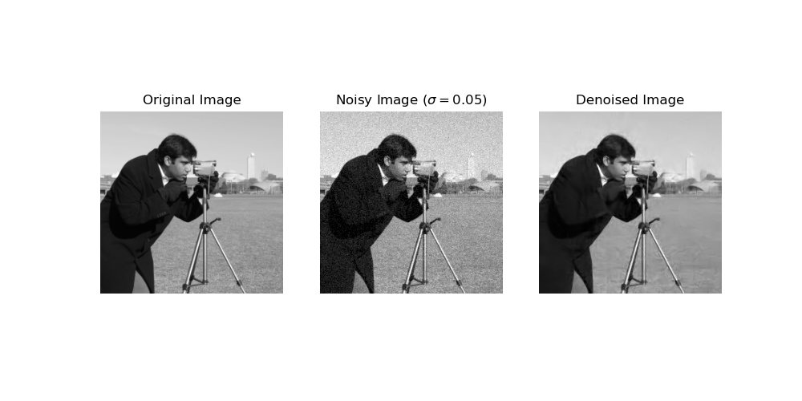

# Learnlet Transform

This code is the PyTorch implementation of the Learnlet transform originally developed in [Ramzi et al., 2020](https://link-to-author-profile-or-paper) and modified in Bonjean et al., 2025 (arxiv link to come soon). The learnlets have been trained on 10,000 images from the ImageNet dataset, and the weights for the default value parameters of the network are automatically loaded when the class is instantiated.

If you use this code, please cite both papers in your work.

## Installation

Clone the repository:

```bash
git clone https://github.com/vicbonj/learnlet.git
cd learnlet/
```
## Usage

Here's an example of how to use the Learnlet transform:

```python
from learnlet.learnlet import Learnlet
import torch
from skimage import data, transform, img_as_float32
import matplotlib.pyplot as plt


device = torch.device(
    "mps" if torch.backends.mps.is_available()
    elif "cuda" if torch.cuda.is_available()
    else "cpu"
)

#Import an example image Y
img = data.camera()
img_256 = transform.resize(img, (256, 256), anti_aliasing=True)
Y = torch.from_numpy(img_as_float32(img_256))[None,None,:].to(device)

#Add noise
sigma = 0.05 #Noise value
noise = torch.randn(Y.shape).to(device) * sigma
Y_noisy = Y + noise

#Apply the Learnlet transform to denoise
learnlet = Learnlet().to(device)
learnlet.load_state_dict(torch.load('weights/LEARNLET_FINAL_64_5_sc5_True_hard.pth', device=device, weights_only=True))
learnlet.eval()
Y_denoised = learnlet(Y_noisy, sigma)

# Visualize the results
plt.figure(figsize=(10, 5))
plt.subplot(1, 3, 1)
plt.imshow(img_256, cmap='gray', vmin=0, vmax=1)
plt.title('Original Image')
plt.axis('off')

plt.subplot(1, 3, 2)
plt.imshow(Y_noisy.cpu().numpy()[0][0], cmap='gray', vmin=0, vmax=1)
plt.title('Noisy Image ($\sigma={:.2f}$)'.format(sigma))
plt.axis('off')

plt.subplot(1, 3, 3)
plt.imshow(Y_denoised.cpu().numpy()[0][0], cmap='gray', vmin=0, vmax=1)
plt.title('Denoised Image')
plt.axis('off')

plt.show()
```


## License

This project is licensed under the MIT License - see the [LICENSE](./LICENSE) file for details.

Author: Victor Bonjean

Mail: victor.bonjean40@gmail.com
